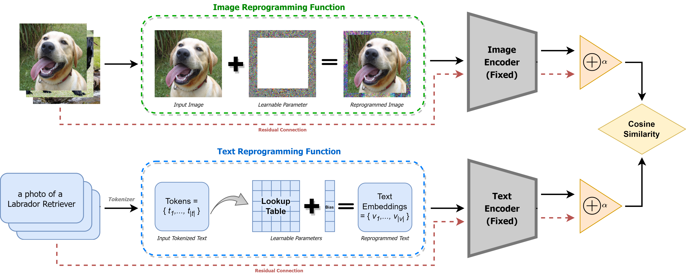

## Model Reprogramming Outperforms Fine-tuning on Out-of-distribution Data in Text-Image Encoders
Andrew Geng, Pin-Yu Chen



This repo contains the reference source code in PyTorch for Reprogrammer. 
For more details please check our paper [Model Reprogramming Outperforms Fine-tuning on Out-of-distribution Data in Text-Image Encoders]() (SatML 24). 

### Dependencies

The code is built with the following libraries:

- [python=3.8.12](https://www.python.org/)
- [torch==1.11.0](https://pytorch.org/)
- [torchvision=0.17](https://pytorch.org/vision/stable/index.html)
- [ftfy=6.1.3](https://pypi.org/project/ftfy/)
- [regex](https://pypi.org/project/regex/)
- [tqdm=4.66.2](https://pypi.org/project/tqdm/)

### Usage

##### Get Started

- To train reprogrammer, run

```
python -u full_reprogramming.py --name=reprogrammer --in-dataset=CIFAR-10 --mr-resolution=32 --gpu=0 >> ./reprogrammer.out
```

- To evaluate reprogrammer OOD Generalization, run

```
python -u evaluate_robustness.py --name=reprogrammer --in-dataset=CIFAR-10 --ood-dataset=CIFAR10.1 --image-resolution=32 --gpu=0 >> robustness_reprogrammer.out
```
- To evaluate reprogrammer OOD Generalization, run

```
python -u evaluate_ood.py --name=reprogrammer --in-dataset=CIFAR-10 --gpu=0 >> ./ood_detection_reprogrammer.out
```

### Citing

If you find our code useful, please consider citing:

```
@inproceedings{
    geng2024rp,
    title={Model Reprogramming Outperforms Fine-tuning on Out-of-distribution Data in Text-Image Encoders},
    author={Andrew Geng and Pin-Yu Chen},
    booktitle={SatML},
    year={2024}
}
```
